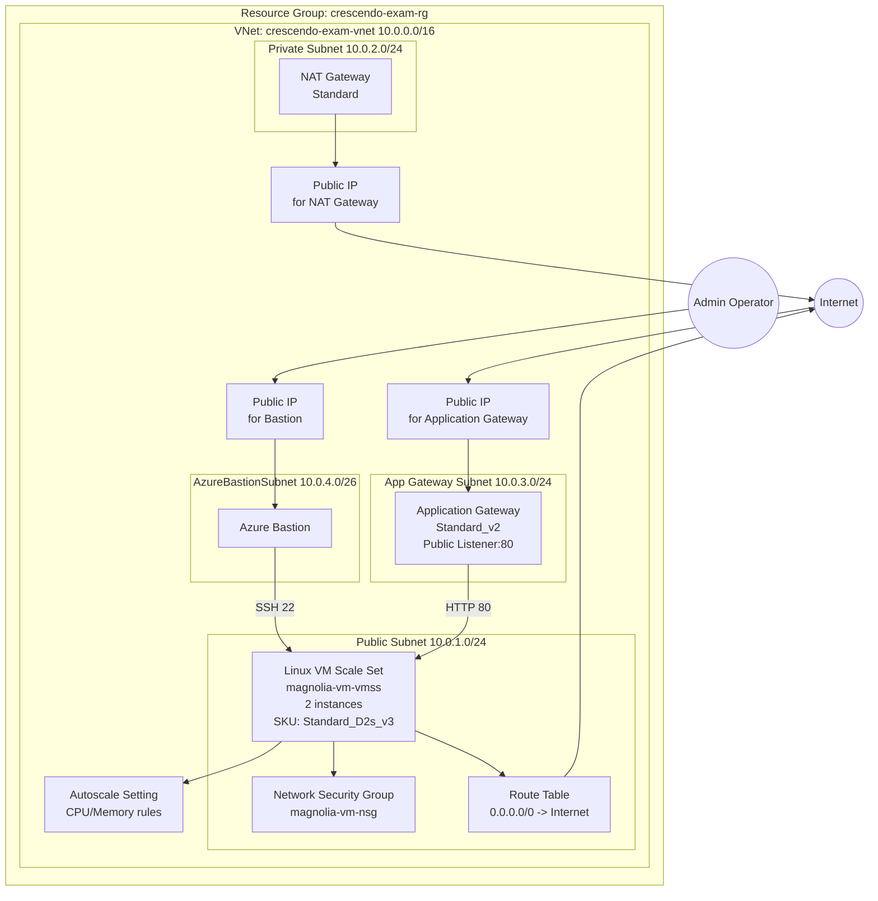

# Procedure

## Making Azure Storage Account as your Terraform Backend
1. Create a `Storage Account` in azure.
2. Inside the generated `Storage Account`, create a container named `tfstate`.
3. To access proceed with either Local Setup or GitHub Account Setup.

### Local Setup
1. Using `az login`, login in Azure Portal using the account that has access to *Step 1*.
2. In the created `Storage Account`, go to `Access Control (IAM)` and add a new role assignment and add a new role called **Storage Blob Data Contributor** & **Contributor** under the account that was used in `az login`.
3. Wait around 3-5mins for the access to refresh and then run `terraform init -backend-config="creds.tfvars"`.

## Azure Architecture Diagram

The following diagram is generated from the Terraform configuration in [terraform/](terraform/) and values in [terraform/terraform.tfvars](terraform/terraform.tfvars).

